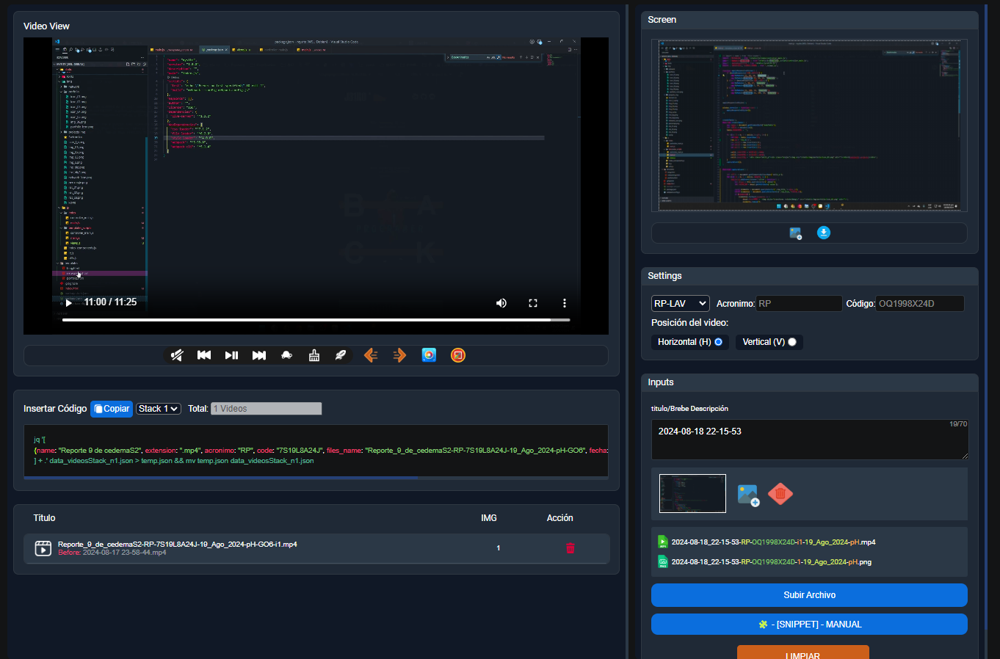

# VIDEO PROCESSOR - SC

    

## Introduction

Video Processor is is a personal project and I use it to manage video.

## Installation

- I use python=3.11.2 in PYENV

- For development, you may build from source

~~~
git clone https://github.com/jeiro-x/cedema-video_processor-SC.git
~~~

- And create the virtual enviroment with venv

~~~
python3 -m venv venv
source venv/bin/activate
cd cedema-video_processor-SC
pip install -r requirements.txt
~~~

My Shell functions:

~~~
video_processor
open_video_processor
~~~